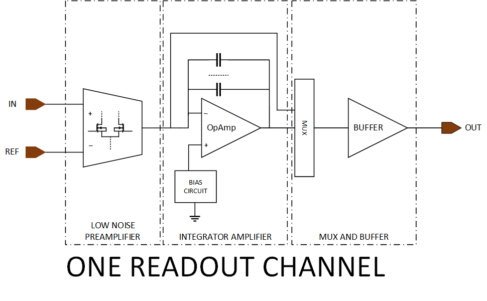

# ColRO - Multi-channel analog readout

  

---

## Description

Accurate, high speed, real-time reading and acquisition of signals from an array of sensors, such as temperature ones, often require advanced signal amplification and noise filtering. Arrays of sensors are used widely in practice, especially in operations and handling that require receiving signals from many different points. In this mixed-signal design, we will develop a multistage signal amplification and readout channel, including a low-noise differential amplifier stage, integrating amplifier stage, correlated double sampling stage, sample and hold stage. Except for the differential stage, the other ones are implemented via an operational amplifier and other microelectronic components such as capacitors and field effect transistors. When applied to an array of sensors, these amplifier and readout channels can be arranged in a parallel manner, ensuring that the outputs of at least 16 (depending on available bonding pads per design) sensors can be simultaneously connected. These output signals will be further processed (off-chip) by analog-digital converters before being hand over to the final processing and monitoring system.

## Block design

## Outcome

The concrete output is an accurate, high-speed, real-time multi-channel (e.g. at least 16 channels) low noise signal amplifier/readout. This amplifier/readout will be applied in practice when connecting at the input with 16 sensors that require accurate signal reading. The output can be connected to a microprocessor that allows to perform analog-to-digital signal conversion, recording and monitoring real-time data. This multi-channel signal readout can be integrated in sensor arrays with a large number serving different purposes in practice.
